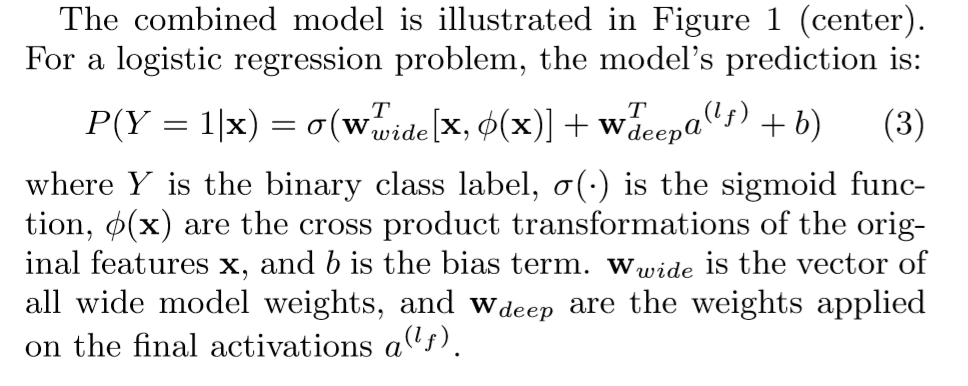

## 优缺点/总结

- Such a method is hard to generalize to model high-order feature interactions or those never or rarely appear in the training dat
- the input of “wide part” still relies on expertise feature engineering.[16]
- 类似于FM，在transaction-attribute矩阵上进行运算

## 解决的问题
- 平衡了wide的保守和deep的over generalize

## 模型
### 结构
- deep module
  - 随机初始化输入的特征向量
  - 三重linear映射+RELU
- wide module
### tricks
- cross-product模拟一条transaction中feature之间的交互
- 避免加入新数据后从头训练，使用特殊的优化函数，将当前参数的值作为初始值进行新一轮训练
### prediction/rating
- 回归计算一个分数，把分数经过sigmoid后作为rating
### Objective Function/Loss Function
- Logistic Loss

### 参数
### optimizer
- mini-batch stochastic optimization
- Followthe-regularized-leader (FTRL) algorithm with L1 regularization as the optimizer for the wide part of the model, and AdaGrad for the deep part