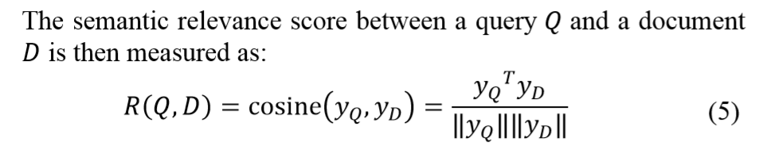
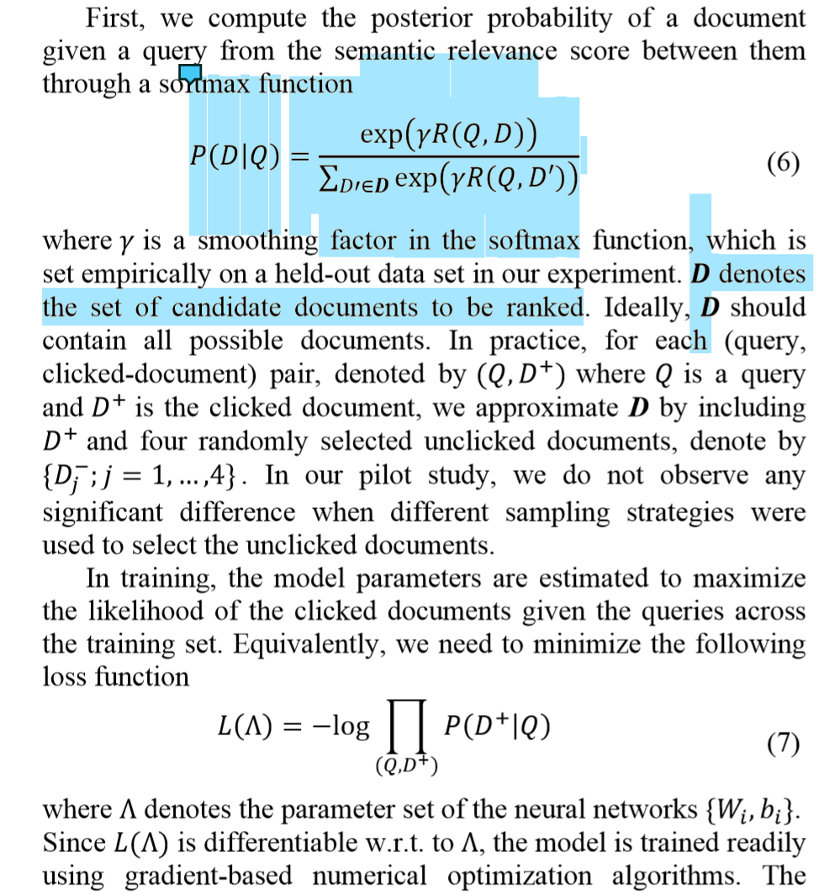

## 优缺点/总结
以往的矩阵分解都是做聚类，用的objective function都是把文档分为好几类，但这个和ranking没有关系，和infomation retrieval挂不上钩
## 解决的问题
- 使用ranking问题的metric来优化MF，让其适用于IR
- 利用深度学习
## 模型
### 结构
- word-hashing$\rightarrow$multi-layer linear projection + activation with tanh$\rightarrow$cosine similarity
### tricks
- word-hashing将article用n-gram的集合表示，显著降维，且碰撞不高，将word-article矩阵变为trigram-article矩阵，**$(i,j)$元对应值为第$j$篇article中出现第$i$个pattern的次数**
- 用随机选的5篇文档代替所有文档（在objective function中）
### prediction/rating
- 用映射到semantic space中的article feature和query feature的cosine相似度计算评分
### Objective Function/Loss Function
- 用得分文档和query的相关度计算给定query后article分布的后验概率，然后用极大似然估计最大化用户点击正例的概率
### 参数
### optimizer