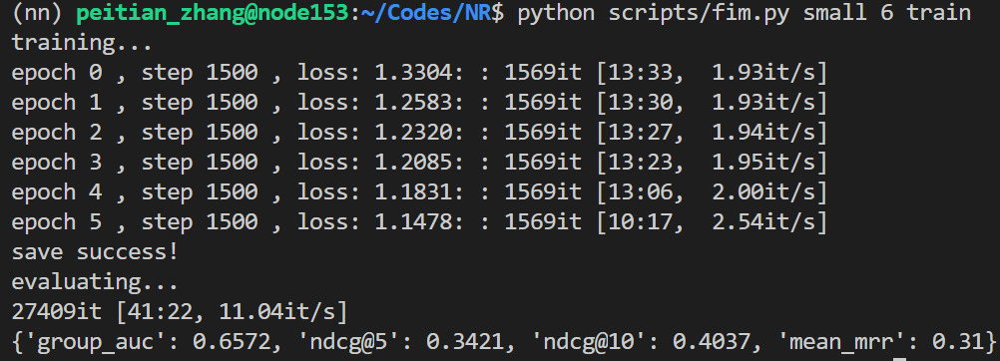
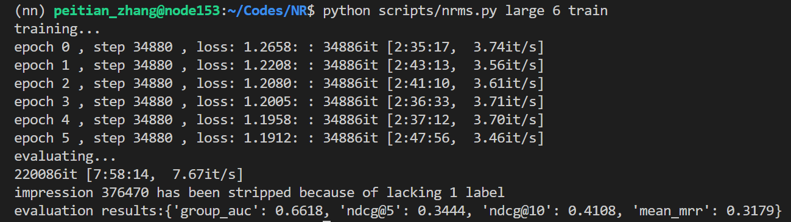

# Code
## Requirements
```shell
python == 3.7.9
torch == 1.6.0
cuda == 10.1
```

## Dataset
download MIND dataset [HERE](https://msnews.github.io/), and customize data path in `manual/[model_name].ipynb` and `scripts/[model_name].py`

## Instruction
*both need customing paths and hyper parameters in advance*
- you can run the specific notebook to train and test the model
  ```shell
  run manual/[model_name].ipynb
  ```

- you can alse run **python scripts** in terminal provided `data_scale`, `epochs`, and `mode` parameters. **eg:**
  ```shell
  cd Codes/
  python scripts/[model_name].py large 10 train
  ```

## File Structure
### `/data`: basic dictionaries
  - dictionary mapping News ID to increasing integer, training set and testing set are separate because order of news ids has effect on neither training or testing
    - `nid2idx_[data_mode]_train.json`
    - `nid2idx_[data_mode]_test.json`
  - dictionary mapping News ID to increasing integer, training set and testing set are unified because user may appear in both training and testing phases which are namely *long-tail users*. However, some users may only appear in testing set, which fomulates *cold start problem*.
    - `uid2idx_[data_mode].json`
  - vocabulary mapping word wokens to increasing integer (**instance of torchtest.vocab**) , which can be applied with pre-trained word embeddings.
    - `vocab_[data_mode].pkl`
  - `/tb`
    - `/[model_name]`
      - log file for `Tensorboard`

### `/manual`: jupyter notebooks for training and testing models
  - [NPA.ipynb](manual/NPA.ipynb)
  - [FIM.ipynb](manual/FIM.ipynb)

  - [Preprocess.ipynb](manual/Preprocess.ipynb)
    - viewing data
  - [torch_tips.ipynb](manual/torch_tips.ipynb)
    - manipulation over `PyTorch`

### `/models`: reproduced models
  - NPA
    - [[23] Npa Neural news recommendation with personalized attention](https://dl.acm.org/doi/abs/10.1145/3292500.3330665)
    - 
  - FIM
    - [[29] Fine-grained Interest Matching for Neural News Recommendation](https://www.aclweb.org/anthology/2020.acl-main.77.pdf)
    - 
  - NRMS
    - [[22] Neural News Recommendation with Multi-Head Self-Attention](https://www.aclweb.org/anthology/D19-1671.pdf)
    - 
  - KNRM
    - [[49] End-to-End Neural Ad-hoc Ranking with Kernel Pooling](https://dl.acm.org/doi/pdf/10.1145/3077136.3080809)
  - Soft Top-k Operator 
    - [[51] Differentiable Top-K Operator with Optimal Transport](https://arxiv.org/pdf/2002.06504.pdf)
    - *copy code from paper*

### `/scripts`: python scripts of models
  - you can run models in `shell`

### `/utils`: data loader and utility functions
- `MIND.py`
  - MIND_map
    - map style dataset
    - return dictionary of one behavior log
      - negtive sampling enabled
  - MIND_iter
    - iterator style dataset
    - return dictionary of one candidate news
      - negtive sampling disabled, **point-wise**, intended for evaluating

- `utils.py`
  - some helper functions
    - construct dictionary
    - wrap training and testing/evaluating

## TODO
- [x] integrate MINDIterator to Datasets and Dataloader
  - motivation: split data with more flexibility, enable distribution
- [x] understand *permute*
- [x] construct `nid2idx` and `uid2idx` according to both training iterator and testing iterator
- [x] analyze MIND dataset, calculate average user history length
- [x] rewrite NPA, user embedding, not user projection
- [x] figure out why FIM suffers
- [x] cosine similarity computation inspection
- [ ] generate negtiva examples
- [ ] BERT cls
- [ ] transformer encoder

## Insights
### Convolution
- calculate *signal_length* $L_{out}$ after convolution:
  - consider a sequence of length $L_{in}$ of signal of *in_channel*, then the output sequence is from $d * (k-1) + 1 - p$ to $L_{in} + p$, then $L_{out}$ as the number of convolution calculations can be derived as $$L_{out} = \frac{L_{in} - d * (k-1) - 1 + 2*p}{s} + 1$$where $d$ denotes *dilation rate*, $k$ denotes *kernel_size*, $p$ denotes *padding(on both sides)* and $s$ denotes *stride*

### Layer Normalization
- *mean and variance* is calculated on each sample rather over the whole batch

### Learning to Rank
- say we got a vector for the relatedness between *query* and *doc*, then we feed the vector into a *MLP(i.e. Multi-Layer Perceptron)* to project the vector into a single value, which stands for the *score*. The above procedure is namely **Learning to Rank** because the weights of *MLP* can be learnt automatically.