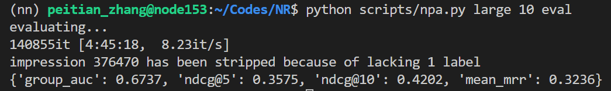

# Code
## Requirements
```shell
python == 3.8.5
torch == 1.7.1
torchtext = 0.8.1
cuda == 10.1
pandas
tqdm
scikit-learn
```

## Dataset
download MIND dataset [HERE](https://msnews.github.io/)
### Simple Analysis
see [HERE](manual/Preprocess.ipynb)
## Instruction
- **you can customize your dataset path in two ways:**
  - modify default value of `path` in `prepare()` in `utils.py` to your own **top directory of `MINDxxxx`**
  - explicitly pass `path` parameter your own **top directory of `MINDxxxx`** when calling `prepare()`

- **ATTENTION! default path of model parameters is**
  ```
  models/model_params
  ``` 
  
- you can run the specific notebook to train and test the model
  ```shell
  run manual/[model_name].ipynb
  ```

- you can alse run **python scripts** in terminal, type in `--help/-h` to get detail explanation of arguments
  ```shell
  usage: baseline_fim.py [-h] -s {demo,small,large} -m {train,test} [-e EPOCHS] [-bs BATCH_SIZE] [-ts TITLE_SIZE] [-hs HIS_SIZE] [-c {0,1}] [-se]
                         [-ss SAVE_STEP] [-te] [-k K] [-np NPRATIO] [-mc METRICS]

  optional arguments:
    -h, --help            show this help message and exit
    -s {demo,small,large}, --scale {demo,small,large}
                          data scale
    -m {train,test}, --mode {train,test}
                          train or test
    -e EPOCHS, --epochs EPOCHS
                          epochs to train the model
    -bs BATCH_SIZE, --batch_size BATCH_SIZE
                          batch size
    -ts TITLE_SIZE, --title_size TITLE_SIZE
                          news title size
    -hs HIS_SIZE, --his_size HIS_SIZE
                          history size
    -c {0,1}, --cuda {0,1}
                          device to run on
    -se, --save_each_epoch
                          if clarified, save model of each epoch
    -ss SAVE_STEP, --save_step SAVE_STEP
                          if clarified, save model at the interval of given steps
    -te, --train_embedding
                          if clarified, word embedding will be fine-tuned
    -k K, --topk K        intend for topk baseline, if clarified, top k history are involved in interaction calculation
    -np NPRATIO, --npratio NPRATIO
                          the number of unclicked news to sample when training
    -mc METRICS, --metric METRICS
                          metrics for evaluating the model, if multiple metrics are needed, seperate with ','
  ```
  - **e.g. train FIM model on MINDlarge for 2 epochs. At the end of each step, save the model, meanwhile, save model every 2000 steps**
    ```shell
    cd Codes/
    python scripts/fim.py --scale large --mode train --epoch 2 --save_each_epoch --save_step 2000
    ```
  - **e.g. test FIM model which were trained on `MINDlarge` and saved at the end of 4000 steps**
    ```shell
    cd Codes/
    python scripts/fim.py -s large -m test --save_step 4000
    ```

## File Structure
### `/data`: basic dictionaries
  - dictionary mapping News ID to increasing integer, training set and testing set are separate because order of news ids has effect on neither training or testing
    - `nid2idx_[data_mode]_train.json`
    - `nid2idx_[data_mode]_test.json`
  - dictionary mapping News ID to increasing integer, training set and testing set are unified because user may appear in both training and testing phases which are namely *long-tail users*. However, some users may only appear in testing set, which fomulates *cold start problem*.
    - `uid2idx_[data_mode].json`
  - vocabulary mapping word wokens to increasing integer (**instance of torchtest.vocab**) , which can be applied with pre-trained word embeddings.
    - `vocab_[data_mode].pkl`
  - `/tb`
    - `/[model_name]`
      - log file for `Tensorboard`

### `/manual`: jupyter notebooks for training and testing models
  - [NPA.ipynb](manual/NPA.ipynb)
  - [FIM.ipynb](manual/FIM.ipynb)

  - [Preprocess.ipynb](manual/Preprocess.ipynb)
    - viewing data
  - [torch_tips.ipynb](manual/torch_tips.ipynb)
    - manipulation over `PyTorch`

### `/models`: reproduced models
  - NPA
    - [[23] Npa Neural news recommendation with personalized attention](https://dl.acm.org/doi/abs/10.1145/3292500.3330665)
    <!-- -  -->
  - FIM
    - [[29] Fine-grained Interest Matching for Neural News Recommendation](https://www.aclweb.org/anthology/2020.acl-main.77.pdf)
    <!-- -  -->
  - NRMS
    - [[22] Neural News Recommendation with Multi-Head Self-Attention](https://www.aclweb.org/anthology/D19-1671.pdf)
    <!-- -  -->
  - KNRM
    - [[49] End-to-End Neural Ad-hoc Ranking with Kernel Pooling](https://dl.acm.org/doi/pdf/10.1145/3077136.3080809)
    <!-- -  -->
  - Soft Top-k Operator 
    - [[51] Differentiable Top-K Operator with Optimal Transport](https://arxiv.org/pdf/2002.06504.pdf)
    - *copy code from paper*

### `/scripts`: python scripts of models
  - you can run models in `shell`

### `/utils`: data loader and utility functions
- `MIND.py`
  - MIND_map
    - map style dataset
    - return dictionary of one behavior log
      - negtive sampling enabled
  - MIND_iter
    - iterator style dataset
    - return dictionary of one candidate news
      - negtive sampling disabled, **point-wise**, intended for evaluating

- `utils.py`
  - some helper functions
    - construct dictionary
    - wrap training and testing/evaluating
## Experiment
### Hyper Parameter Settings
- `title-size=20`
  - the length of news title, pad 0 if less, strip off if more
  - none of category, subcategory and absract is involved
- `his-size=50`
  - the length of user history, pad 0 if less, strip off if more
  - in `baseline`, `his-size=100`

### Performance
**the model is run on `MINDlarge` if not specified**
|model|AUC|MRR|NDCG@5|NDCG@10|benchmark-achieve-at|
|:-:|:-:|:-:|:-:|:-:|:-:|
|NPA|$\mathbf{0.6705}$|$0.3147$|$0.3492$|$0.4118$|`epoch=5`|
|FIM|$0.6677$|$\mathbf{0.3202}$|$\mathbf{0.3518}$|$\mathbf{0.4147}$|`step=10000`|
|NRMS|$0.6618$|$0.3179$|$0.3444$|$0.4108$|`epoch=6`|
|ITR-CNN-CNN|$0.647$|$0.3022$|$0.3289$|$0.3957$|`epoch=1`|
|ITR-MHA-MHA|$0.6201$|||
|baseline-FIM|$0.6439$|$0.2947$|$0.3239$|$0.3881$|`epochs=5` run on `MINDsmall`|
|baseline-CNN-CNN|$$|$$|$$|$$||
|baseline-CNN-MHA||||||
|baseline-MHA-CNN|||||
|baseline-MHA-MHA|$0.6395$|$0.2934$|$0.3203$|$0.385$|`epoch=8` run on `MINDsmall`|
|baseline-CNN-KNRM|
|baseline-MHA-KNRM|
|baseline-parallel|||||
|baseline-end2end|
|baseline-unified|
## TODO
- [x] integrate MINDIterator to Datasets and Dataloader
- [x] understand *permute*
- [x] construct `nid2idx` and `uid2idx` according to both training iterator and testing iterator
- [x] analyze MIND dataset, calculate average user history length
- [x] rewrite NPA, user embedding, not user projection
- [x] figure out why FIM suffers
- [x] cosine similarity computation inspection
- [x] generate negtiva examples
- [ ] BERT cls
- [x] transformer encoder
- [x] knrm mask值
- [x] transformer交互
- [x] interact with negtive samples
  - negtive samples unavailable
- [x] test multi-head encoder and CNN encoder
- [ ] test complete transformer
- [x] greedy select with gumbel-softmax