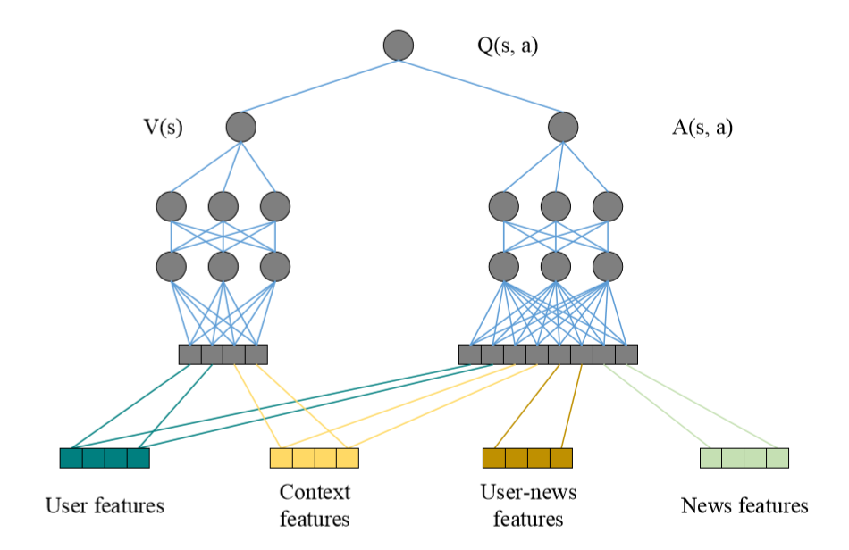

## Motivation
- 虽说是dynamic，但是调整的是exploit和explore之间的平衡，但实际发生的场景是explore了一个后他就想exploit，然后腻了再explore
## Notations
给定用户$u$，新闻$v$
## 模型结构
### feature construction
- news feature：one hot 向量概括某一个的一些属性：标题、主题、出版商等
- user feature：记录用户点击过的新闻中所包含的news feature
- user-news feature：记录特定的新闻的某些实体在特定用户的历史记录中出现频率
- context feature：记录新闻recency、发布时间等等信息
### reinforcement learning
- agent：recommender
- environment：news and users
- action：sequential news transition represented by news features and user-news features
- state：represented by user features and context features
### deep q-learning

### explore
在W矩阵上做一些微小的改变，用作explore

## Tricks
## Objective Function/Loss Function
### Minor
- 动态调整explore和exploit的权重
### Major
- experience replay

## 参数
## Optimizer
## 问题