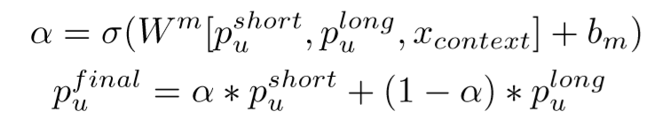
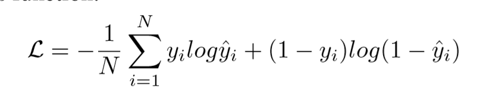

## 优缺点/总结
- 考虑long-term画像和short-term画像
- 使用考虑时间、考虑内容的RNN完成*Sequential Recommending*，捕捉用户*连续*的访问以及*间隔*的访问
  - 解决动态变化的用户兴趣和动态变化的用户session
- 用attn结合long-term和short-term
## 模型
### 结构
- short term modeling
  - Time Irregularity
    - 分别用两个向量$T_1,T_2$捕捉用户平均点击下一个article的interval，以及用户要预测的article和用户上一个点击的article之间的interval，将其融合在LSTM中
  - Semantic Irregularity
    - 用attn解决，将要预测的article的另一种repr作为query计算权重，将该权重应用到LSTM中
    - 在LSTM所有隐状态中再使用一次attn，将所有隐状态加权求和得到最终用户的短期画像
- long term modeling
  - 输入用户的点击历史
  - 使用attn将点击历史中的article的repr加权求和得到用户长期画像
- adaptive fusion
  - 使用前馈网络将长短期画像串连

### prediction/rating
- 将用户向量$p_u$和article向量$q_i$通过两层MLP，得到最终相关度
### Objective Function/Loss Function
- 看做二分类问题，直接log-loss
### 问题
- 没看到它怎么表示的item