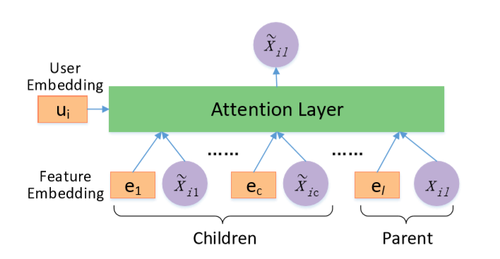
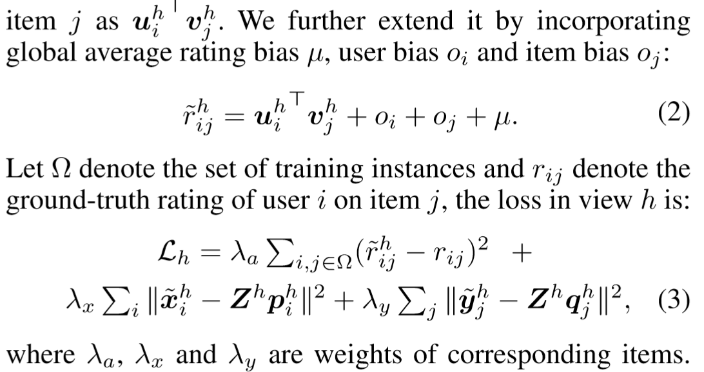
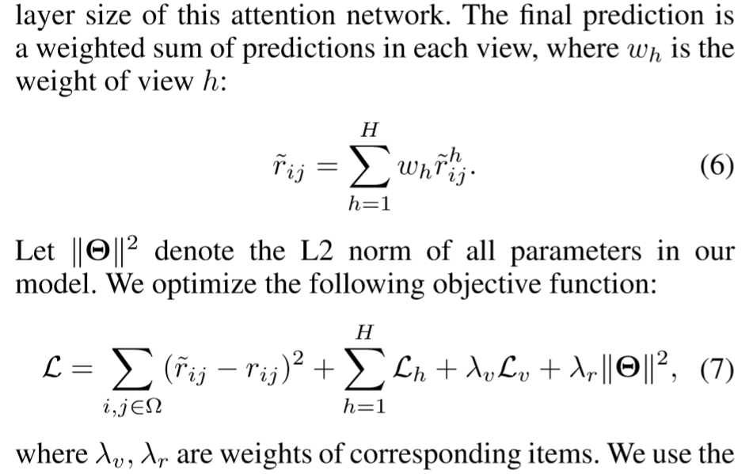

## 优缺点/总结
- 准确率高的模型太深，难解释
- 解释性强的模型太浅，效果没深的好
- 分层次地建模用户的兴趣
- 太复杂了。。。
## 模型结构
### 利用知识图谱和“is a”关系构造树
### hierarchical propagation

1. 将user review中的词对应到Knowledge Graph中的实体
2. 将user表示为$u_i = (id,x_i)$，$x_i = (x_i^1,...,x_i^k)$为各个实体出现的次数，用$x_i^k$衡量用户对第k个实体的兴趣
3. 树的每一层都用attn将树中父节点表示为子节点的加权平均，得到第$h$层用户特征$u_i^h$，同理得到item特征$v_j^h$；将每一层看做一个view
4. 最终可以获得整个user/item的全局特征表达$u_i$和$v_j$
### attentive multi-view learning
- 单个view内部，使用EFM根据$u_i^h$和$v_j^h$计算得分数，
使用attn将多个view的特征穿起来，得到最终的用户特征$u$和item特征$v$
### coregularization
- 多个view计算的分数不能相差过大，*maximize agreement*

## tricks
## Objective Function/Loss Function
### attentive multi-view learning
1. 单个view内引入四个隐向量$p_i,q_j$和$c_i,d_j$分别模拟显性特征和隐性特征，将$p_i,q_j$分别与$c_i,d_j$拼接得到$u_i,v_j$
2. 将$p_i,q_j$映射到$u_i^h$和$v_j^h$的维度
3. MSE计算loss
4. 将多个view通过穿起来后
## 参数
## optimizer
## 问题