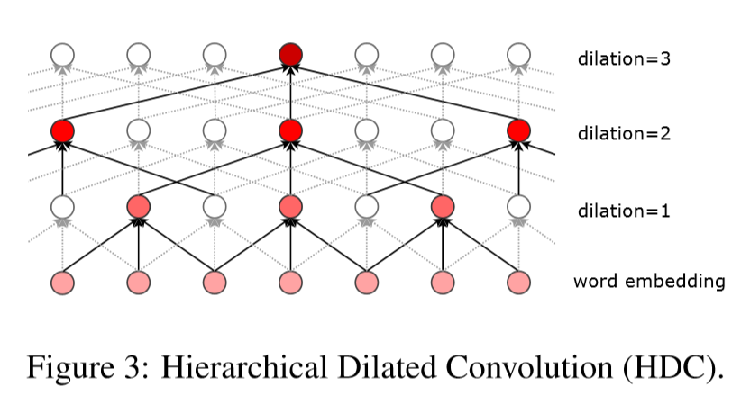
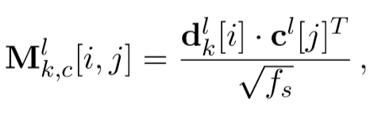
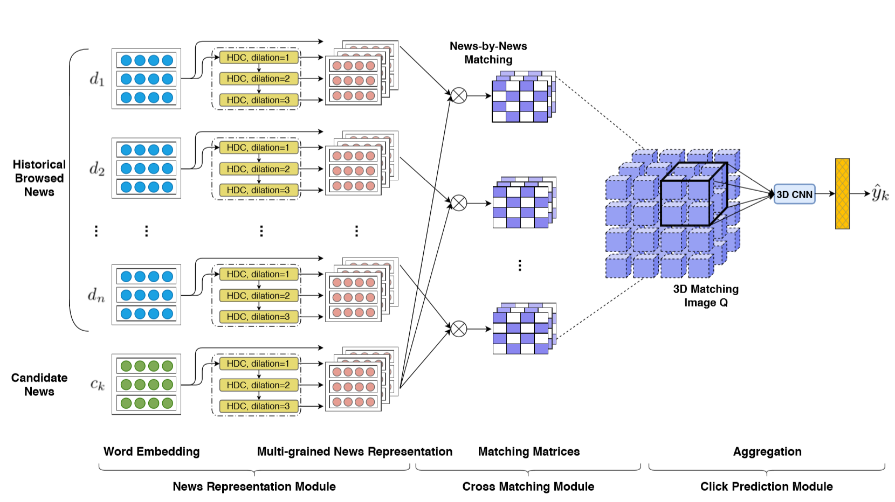

## 优缺点/总结
- 用户的浏览记录可能不是每一个都与candidate有关
## 模型结构
### news representation module
- 输入文章title+category+subcategory连接而成的单词序列，将其通过lookup table转换为embedding
- 使用hierarchical dilated convolution（HDC）蒸馏信息，第一层包含所有单词，第二层之后逐渐dilate，第$h$层的输出记为$d^h$，设总层数$L$，则最终新闻$i$的表示为$[d_i^l]_{l=0}^L$
  - 比RNN，attention都好，占用内存少，并行能力强
- 防止梯度消失或梯度爆炸：layer normalization
### Cross Interaction Module
- 输入用户浏览历史的文章$u$，候选文章$v$，计算$u,v$之间的相关度
1. 构造$L+1$个矩阵，第$l$个矩阵的$(i,j)$元是第$l$层表示下$u$和$v$的特征向量内积
  
2. 构造一个3D矩阵，将$L+1$个上述矩阵摞在一起
3. 3D CNN获得一个包含用户信息和新闻信息的feature
4. neural获得计算得relevance
5. softmax计算点击概率
## tricks
## Objective Function/Loss Function
- MLE
## 参数
## optimizer
## 问题