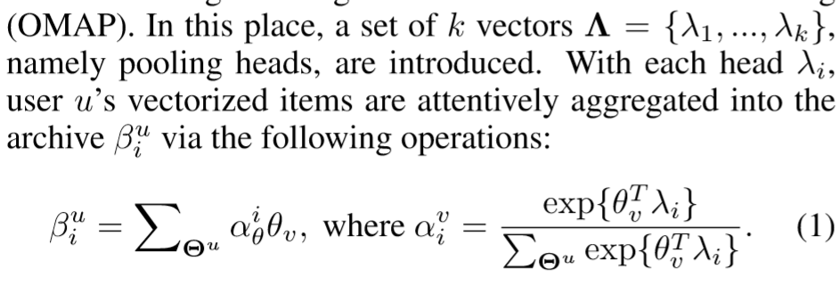

## 优缺点/总结
- 很多推荐系统只在线下计算用户画像，很不精确
- 线上计算画像的太慢
- 提出在压缩的向量中计算用户画像

### 总结
将用户的repr在线学习还能压缩起来存储
## 模型结构
### notation
给定用户$u$，新闻$v$
### Orthogonal Multi-head Attentive Pooling
1. **vectorize**：将用户浏览历史的item set $V^u$中的各个item转化为向量，得到$\Theta^u = \{\theta_1,\theta_2,...\}$
2. **multi-head pooling**：引入$\Lambda = \{\lambda_1,...,\lambda_k\}$作为k个attention head，这k个向量从不同维度保留$\Theta^u$的信息，最终得到用户feature$\beta_u^i$
### 后面的不想看了
## tricks
## Objective Function/Loss Function
## 参数
## optimizer
## 问题