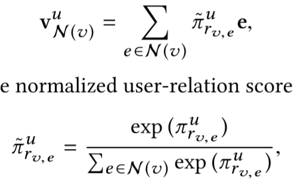
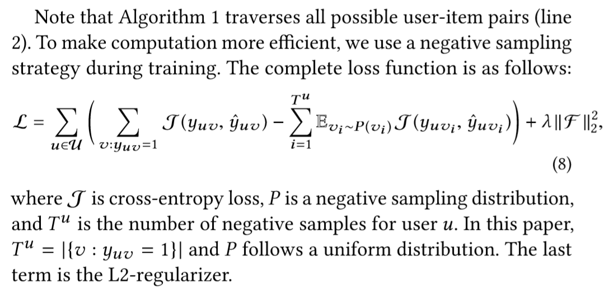

## 优缺点/总结
- 现有的知识图谱表示模型主要适用于连接预测等在图上进行地操作，和推荐没啥关系，因此提出一个针对推荐系统的知识图谱表示办法
## Notations
给定用户$u$，新闻$v$
## 模型结构
### KCGN
- 单层
  1. 将所有item建成一个“知识图谱”，item即为实体
  2. **表示实体**：给定实体$e$，计算$u$对实体$e$的各个边的感兴趣程度$\pi_r^u = g(u,r)$，将其作为权重，计算item的表示（随机选取k个neighbor）
  3. **aggregation**：将$v$的repr和$v_{\mathcal{N(v)}}^u$结合，映射到$\mathbb{R}^d$
- 多层
  1. 表示实体时递归$H$步(hop)，计算repr
  2. 最后一层的repr和用户feature$u$结合，用$f\in\mathbb{R}^d * \mathbb{R}^d \rightarrow \mathbb{R}$映射到实数空间，得到评分

## Tricks
## Objective Function/Loss Function
### 正例减负例？

## 参数
## optimizer
## 问题