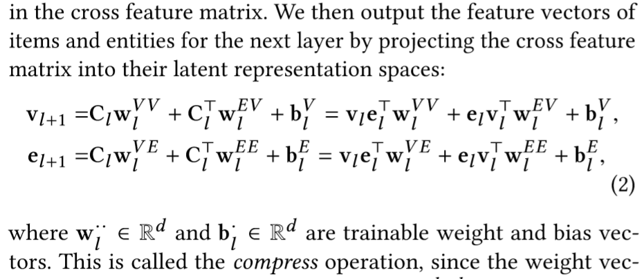
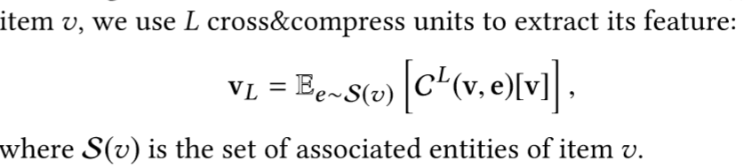
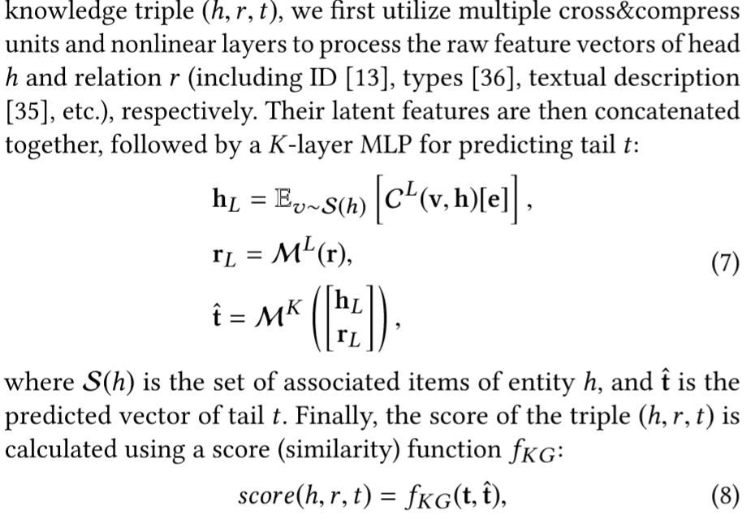

## 优缺点/总结
- DKN需要提前获得entity embedding，不能端到端学习
- RippleNet无法反映KG中边的重要性
- CKE的KG和CF结合不紧密，而且KGE主要用于in-graph task，不适用于推荐
## Notations
给定用户$u$，新闻$v$，新闻中包含的实体$\mathcal{E}={e_1,...,e_k}$
## 模型结构
### Cross-Compress Unit
- 输入$v$和与之关联的$e$，有很多层，每一层将输入的$v$和$e$的repr映射到$d$维，最终得到$v$和$e$的表示
- **cross**：设第$l$层嵌入得到$v_l$和$e_l$，外积$v_l\cdot e_l^T$得到第$l$层item和entity的*interaction matrix*，这叫做*cross*
- **compress**：
### Recommendation Module
- 输入$u$、$v$的原始表达
- 用$L$层的MLP将$u$映射到隐空间
- 用cross-compress unit将$v$用其相关联的实体嵌入进行表示
- 通过$\sigma(f(u,v))$计算最终点击概率
### Knowledge Graph Embedding Module
- 输入头实体$h$和关系$r$，输出预测的尾实体$t$，使用$f(h,t)$将其和真正的尾实体进行比对评分
## Tricks
## Objective Function/Loss Function
## 参数
## Optimizer
## 问题