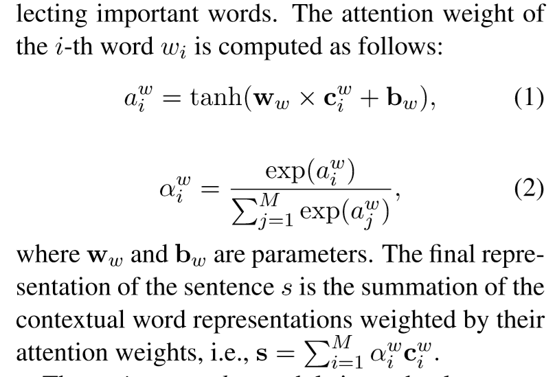

## 优缺点/总结
- 应该模拟user-user，item-item之间的联系
## Notations
给定用户$u$，新闻$v$
## 模型结构
### Review Content View
1. word-embedding：直接用lookup table（pretrained）将单词映射为向量，然后使用CNN丰富该向量内容
2. word-level attn：得到sentence embedding
### Review Encoder
1. sentence-CNN：捕捉句子级别的local text，丰富$s_i$
2. sentence-level attn，得到review embedding $r$
### user/item encoder
1. review-level attn，得到user embedding $u$
2. item embedding同理
### User/Item Graph View
1. 将用户用其相邻item表示
2. 将item用其相邻user表示
3. user/item各自再用id表示
4. 最终得到用户表示$u_g$，$v_g$
### Prediction
将$u,u_g$拼接，item同理，最终内积
## Tricks
## Objective Function/Loss Function
## 参数
## Optimizer
## 问题