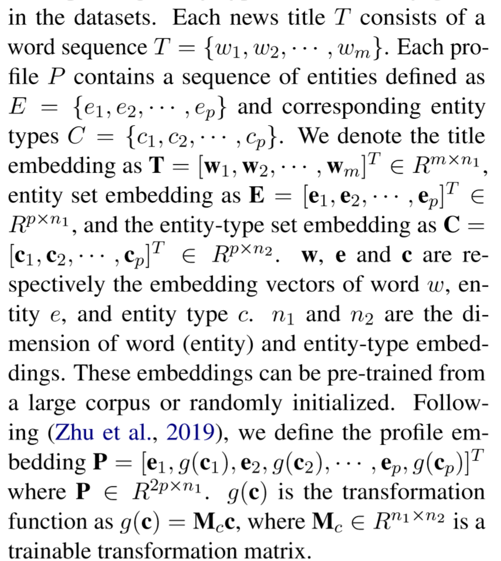
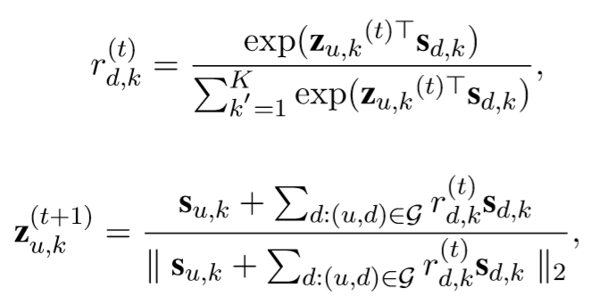
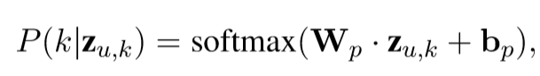
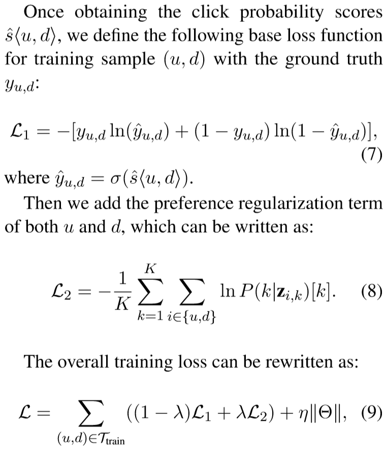

## 优缺点/总结
## Notations
给定用户$u$，新闻$v$，$v$对应其标题$t = \{w_1,...,w_m\}$和实体集$P = \{(e_1,t_1),...,(e_p,t_p)\}$，其中$t_i$为对应实体的类别，
## 模型结构
### News Content Information Extractor
PCNN分别应用在$T$和$P$上，最终得到的向量拼接在一起作为新闻repr
### Graph Convolution Layer with Preference Disentanglement
- 构造新闻和user的二部图
- 用户节点被表示为随机的user embedding $h_u$，article节点被表示为*NCIE*得到的新闻embedding $h_d$
- 给定$h_d$，将其映射到k个不同的隐空间中，记第$l$层得到的表达为$s_d^l$，给定$h_u$，同样将其映射到k个不同的隐空间中，记第$l$层得到的表达为$s_u^l$，计算$s_u^l$和与$u$相邻的item的第$l$层表达$s_d^l$的相似度$r_{ud}^k$，将其作为权重加权平均求得$z_{u,d}^l$，迭代$T$次，得到第$l$层最终的用户表达$z_{u}^l$（文中记为$z_{u,k}$）
- 最后把$L$层得到的$z_{u,l}$拼接，形成最终的用户表达$y_u^L$
### Preference Regularizer
大致意思：给定第$k$层的用户表达$z_{u}^k$，将其通过如下算式，计算其在各个层上的分布，不懂有啥用，大概通过优化logloss让别的层的可能性变低，属于当前层的可能性最高
### prediction
再将$y_u$和$y_d$通过一层perceptron，得到$y_u'$和$y_d'$，两者内积，得到分数
## Tricks
## Objective Function/Loss Function

- 训练时采取一个正例对一个负例
## 参数
## Optimizer
## 问题