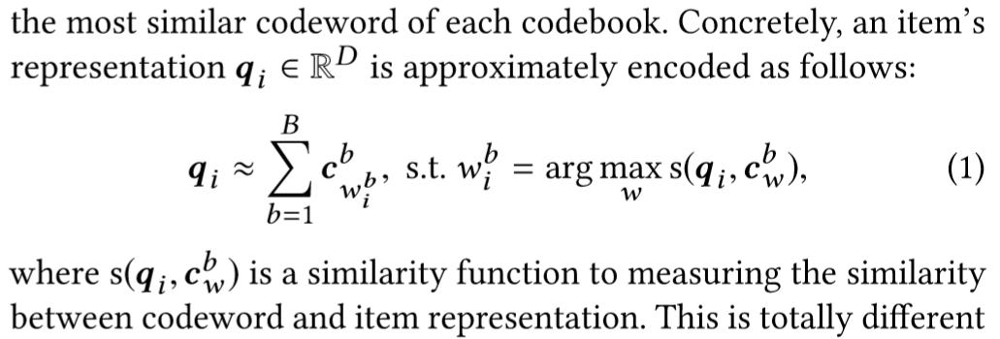
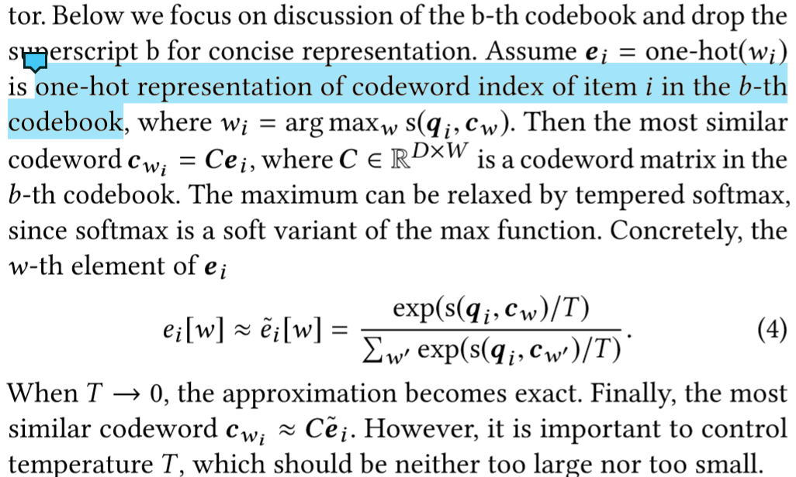
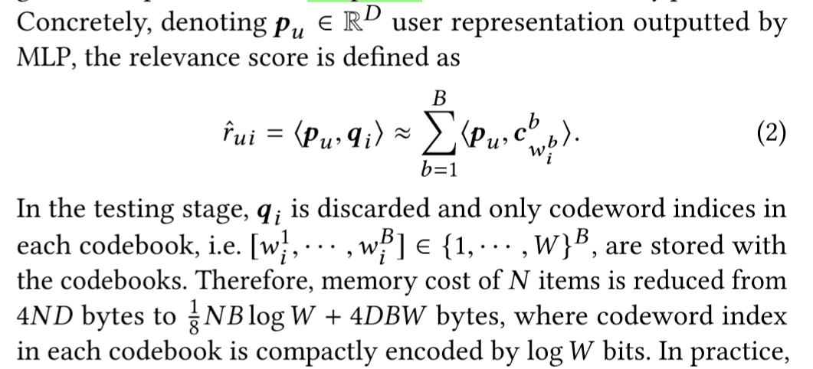
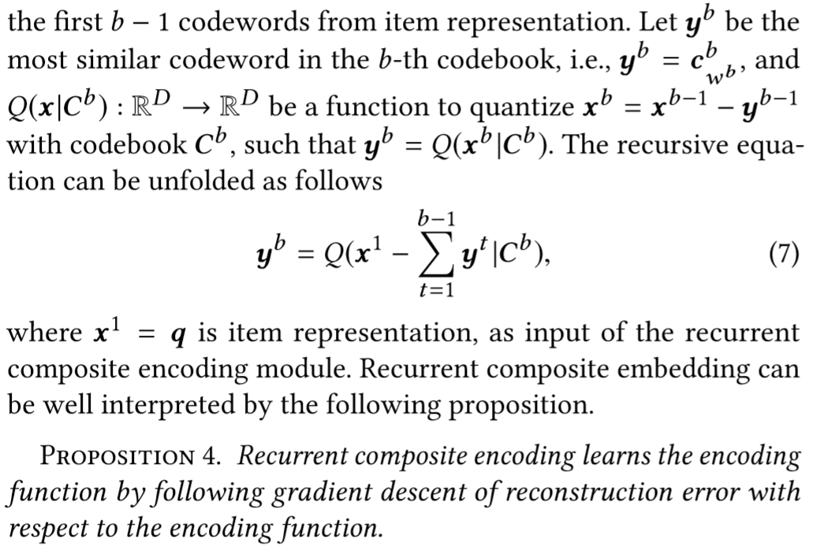

## 问题
1. **codebook中的codeword到底是怎么得到的???**
2. **如何判别不同codebook中的codeword???**
## 优缺点/总结
### search recommendation
- hash-based：学习用户和item的二进制表示，直接cpu级别运算计算相似度，可以达到线性时间
  - 容量太小，不适用新闻推荐
- index-based：为实值的item representation构建索引，使用启发式搜索等方法进行查找
  - 索引独立于item representation，不能端到端学习
  - 构造索引时常用2-means，使用欧氏距离将相近点聚类，不符合计算relevance时使用的内积
## Notations
- 给定用户$u\in\mathcal{U}$，物品$i\in \mathcal{I}$，$|\mathcal{U}| = M$，$|\mathcal{I}| = N$
- $|codebooks| = B$，$|codewords\ in\ each\ codebook| = W$，记$c_w^d\in \mathbb{R}^d$为第$d$个codebook的第$w$个codeword
## 模型结构
### codebook
- 4个codebook，每一个包含4个codeword，那么包含某个codeword就可以用二进制数表示：包含第二个codeword=10，第三个=11
### item encoding
- 从每个codebook中选出和$i$最相近的codeword，将item表示为这些codeword的和，得到item_embedding $\mathbf{q_i}$
  - 注意到argmax不可导，为了端到端学习，使用softmax
  - 训练相似度函数$s(q_i,c_w^b)$
- 用index来存储$q_i$（因为每一个元素其实都是对应codebooks中的codeword）
### recommendation
- $s(q_i,c_w^b)$为内积
  - **使用MLP输出的作为用户画像，没有用codeword表示啊!!!!**
- 提前计算用户和item的相关度，存到表里，使用*inverted index*查询
  - 没有考虑用户repr的变化（离线计算）
### recurrent composite encoding
- 确保codebooks之间是不同的
  - diversity regularization
    - 要计算codebook两两之间的diversity regularizer，计算量太大
  - 使用本文的方法
    - 把B个codebooks的quantization function连起来，参照*gradient boosting*
### Knowledge Distillation
- 在训练composite encoding的同时还需要保留词原来的信息
- 用预训练的词嵌入建立一个模型，用composite encoding的词嵌入建立一个模型，两者之上建立loss？？？
## Tricks
- stop-gradient：前向传播（预测）时用独热表达$e_i$，反向传播（更新参数）时用softmax得到的$\tilde{x}$

## Objective Function/Loss Function
## 参数
## Optimizer