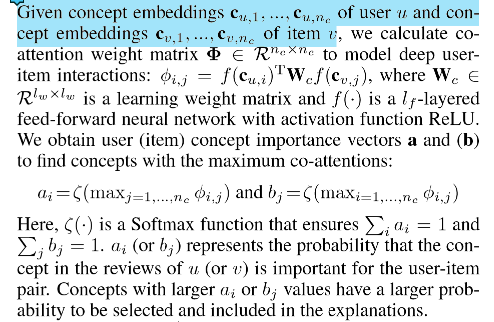
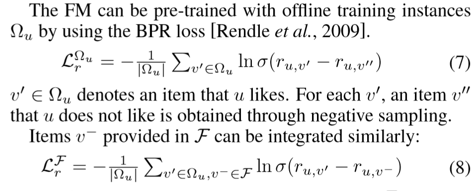

## 优缺点/总结
## Notations
给定用户$u$，新闻$v$
## 模型结构
### Incremental Cross Knowledge Modeling
- Context-aware concept embedding：把用户、item根据其review中出现的concepts(entities)表示为向量
- Co-attentive concept importance modeling：
- 选出user和item中重要的concepts，据此构建user embedding和item embedding，同时构造一个lookup table来模拟隐藏的用户兴趣和item feature，两者结合成为最终的用户embedding，item embedding
- 将user embedding和item embedding拼接起来输入FM中，得到最终分数
## Tricks
## Objective Function/Loss Function

## 参数
## Optimizer
## 问题