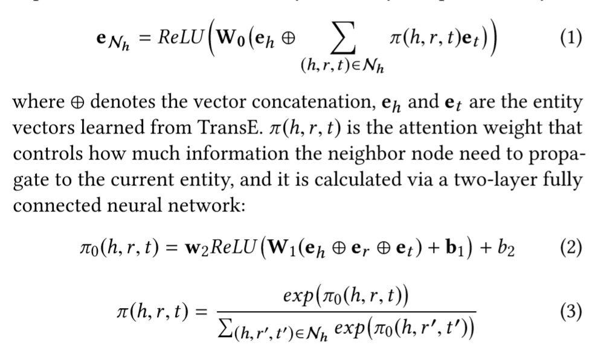
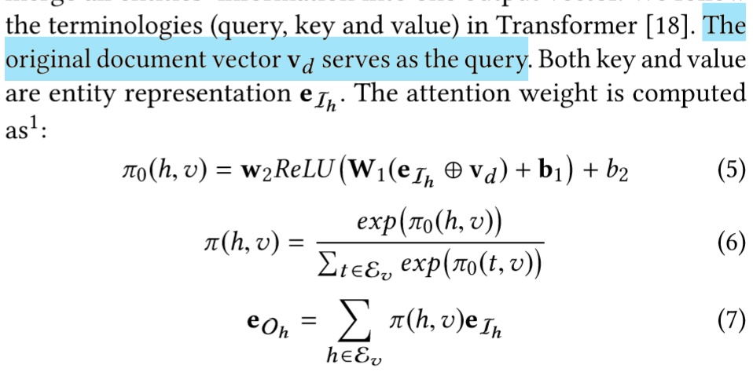
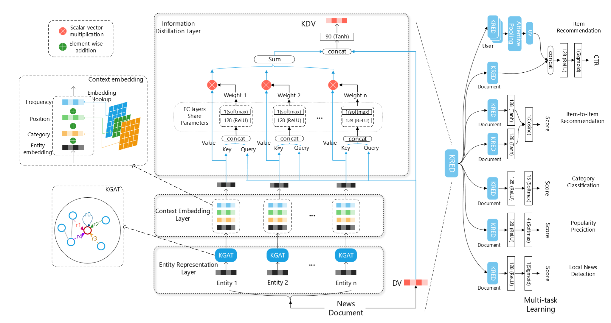

## 优缺点/总结
- 用一个统一的模型直接将文档用知识表示出来
  - 不需要限制文档的原始表达形式
## Notations
给定用户$u$，新闻$v$
## 模型结构
### Entity Representation Layer
1. 将知识图谱中所有entity、relation都用transE嵌入为embedding
2. 将单个entity的embedding通过KGAT与其邻居entity结合，构成最终entity embedding
### Context Embedding Layer
- position encoding：给每一个entity embedding加一个bias，表明其是在title中还是在body中
- frequency encoding：计算entity出现在文档中的次数，构造lookup table以*次数*作为索引，直接将对应embedding加到对应entity embedding上
- category encoding：构造lookup table以category为索引，直接将对应embedding加到entity embedding上
### Knowledge Distillation
1. 用attention将各个entity的embedding动态结合，以文章表达$v_d$作为query
2. 最后将得到的$e_{O_h}$和$v_d$拼接，再通过perceptron得到最终的表达向量$v_k$
### Multi-task

## Tricks
## Objective Function/Loss Function
- 对于推荐，还是使用MLE
- 别的，使用cross-entropy
## 参数
## Optimizer
## 问题