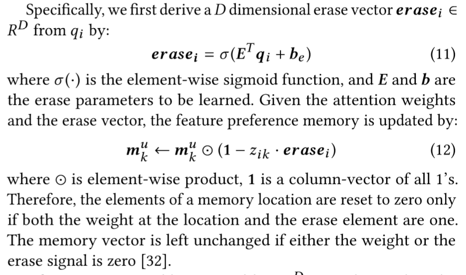
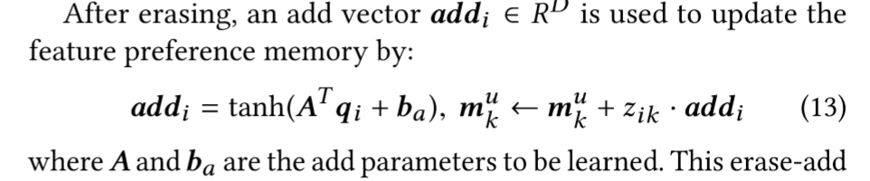

## 优缺点/总结
- 已有的Sequential recommendation将用户压缩到一个向量进行表示，丧失了很多信息
## Notations
给定用户$u$，新闻$v$
## 模型结构
### item level RUM
- memory matrix：构造矩阵，一列是用户购买过的item的embedding
- reader：使用candidate item的embedding作为query，使用attention集成memory matrix的每一列，读出表达
- writer：first in first out，替换在内存中呆了最久的item embedding

### feature level RUM
- global latent feature table：保存$K$个feature的embedding$\ \in \mathbb{R}^d$
- memory matrix：构造矩阵，**第$k$列是用户对第$k$个feature的preference**
- reader：输入item embedding $v\in\mathbb{R}^d$，计算其和各个feature的相关度，用此attentively aggregate columns in feature memory matrix
  - 我觉得有一丝不合理，我矩阵里存的对各个feature的偏好，我用item和各个feature的相关度做权重然后attention集成偏好？多少沾点
  - **不过好像常规方法的user profile保留的也是用户的偏好**
- writer
  - 先擦除（erase）：将candidate item embedding $q\in\mathbb{R}^d$映射到为erase权重，然后和attention score相乘，得到在某一列应该擦出的部分
  - 再写入（add）：和erase同理，学习得到需要加强记忆的部分，然后加进去
## Tricks
## Objective Function/Loss Function
binary cross-entropy

## 参数
## Optimizer
## 问题