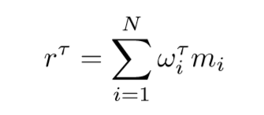
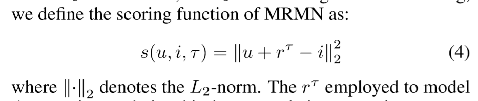

## Motivation
- 现有的方法很少利用除了点击之外的信息
- 除了模拟用户的兴趣，应该模拟其偏好，即不喜欢什么
- 设计一个普适的融合多种用户反馈的推荐系统
## Notations
给定用户$u$，新闻$v$，$\tau \in T$为一种用户反馈，共$t$种反馈
## 模型结构
- 对每一种用户反馈，构造矩阵$Y^\tau$，$i,j$元为1代表有这个类型的互动
### user item embedding
- 原始输入用户/item id的独热向量
- 将其映射为稠密向量
- 两者做Hadamard product得到联合向量$v\in\mathbb{R}^d$
### memory network
- 为每一个用户构造t个memory matrix，每一个都是$d\times N$维，$N$为根据用户定义的超参数
  - 如何得到N？
- 将联合向量作为query，和每一个memory slot对比，得到每一个slot对当前interaction的*贡献/权重*$\ \omega_i$
### Multi-relational Vectors Generation
- 构造一个统一的memory matrix $M\in\mathbb{R}^{d*N}$，每一列可以看做是构造关系表示的单元（pooling head）
- 利用之前算出的权重$\omega_i$，attentively计算每一种反馈的表示向量
  
  - **每一种反馈$\tau$下，有candidate对各个memory slot的相关度，然后attentively aggregate into 一个向量**
  - **每一个pooling head下，有用户历史记录对各个pooling head的相关度，然后attentively aggregate into archive**
### prediction
给定用户表达$u$，item表达$v$，某一种反馈的表达$r^\tau$，则分值为
## Tricks
## Objective Function/Loss Function
## 参数
## Optimizer
## 问题