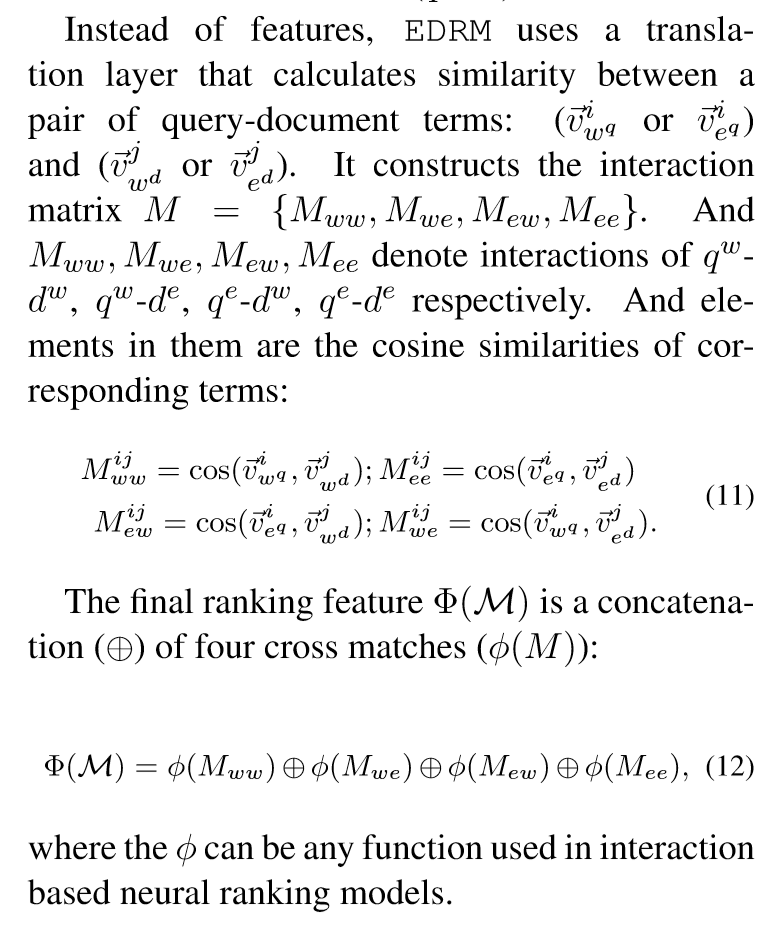

## Motivation
- 将知识图谱的信息结合到interaction-based IR中
## Notations
给定用户$u$，新闻$v$
## 模型结构
### Semantic Entity Representation
- entity embedding：lookup table
- description embedding：cnn将实体的描述文本变成一条向量
- type embedding：一个实体有多种类型，每一种都对应了其embedding，将document/query repr作为query，type embedding作为key和value，集成得到最终的type embedding
- linear layer来combine三种embedding

### Neural Entity-Duet Frame work
- 构造四个矩阵，记录query和candidate之间的相似度，然后输出得分
## Tricks
## Objective Function/Loss Function
## 参数
## Optimizer
## Evaluation Metric
## 问题