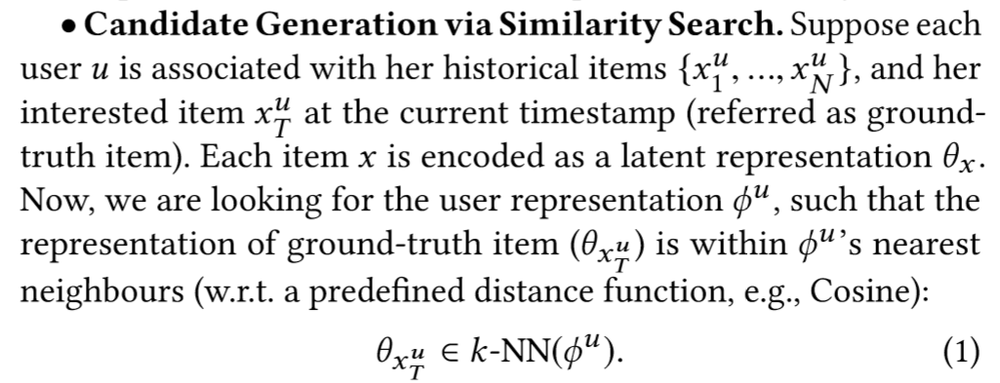

## Motivation
- 现有的multi-head的方法都固定了k，面临up/down generalize
- 将所有head的信息考虑进最后的用户画像，和item做对比是不对的，这会错误的更新不相关archive的值
## Notations

## 模型结构
### Elastic Archive Network
- channel deployment：
  - 每一个channel由两部分构成：group head和aggregation head
    - group head用来概括用户的各种可能的兴趣
      - 初始化为整个item repr空间的正交基
      - 在后续的训练过程中需要 一直保持其正交性
    - aggregation head用来表示用户的最终向量
    - 相当于[31]不用原来的item vector attentively aggregate into archive，而是使用aggregation head集成为archive
- diversified user representation
  - channel activation
    - 构造$A\in \mathbb{R}^{N*M}$，N为某一个用户的浏览历史中item的个数，M为channel个数，则$i,j$元为第$i$个历史记录与第$j$个channel的相关程度，选取每一行值最大的channel，激活这个channel；
  - grouped attentive aggregation
    - user点击过的item根据其对应的channel被分为多个组
    - attentive aggregate 每一个组内的user repr，使用当前channel的aggregation head作为query，item repr作为key和value
- 如何预测？
- integration of candidates
  - 每一个user repr都会有最邻近的item，那每一个user repr下到底选多少个作为candidate呢
    - integrate by competition
      - 每一个user repr下都能算出item和user repr之间的距离
      - 把所有user repr下的item和user之间的距离混在一起排序，输出前k个
      - 不够精确
    - integrate by allocation
      - 给每一个user repr分配不同的名额
      - 使用MLP将每一个user repr映射为归一化的权重（分布）
      - 使用和待聚类item最相似的user repr作为lable，训练多分类器
        - 为什么item只能属于一个类？？
      - 使用*α-proportional*
## Tricks
## Objective Function/Loss Function
- 从user的多个repr中选出和待聚类item最相似的
- 最小化两者之间的距离
## Evaluation Metric
- Min-Max：某一个用户浏览历史中的所有新闻和每一个用户画像的相似度的最大值的和的最小值
- Average：某一个用户浏览历史中的所有新闻和每一个用户画像的相似度的平均
- 两个值都是越大越好
  

## 参数
## Optimizer
## 问题